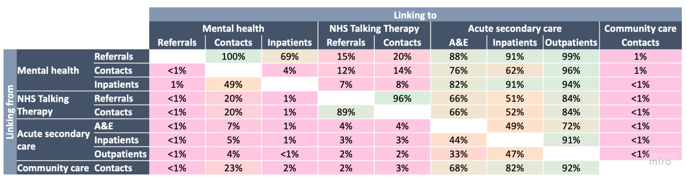

<!-- PROJECT LOGO -->
 

  

  <h3 align="center">Data Quality Checklist</h3>

  

    Find your problems before 10pm the night before the outputs are due.
  

<!-- TABLE OF CONTENTS -->

  
Table of Contents

  <ol>
    <li>
      <a href="#background-reading">Background reading</a>
    </li>
    <li>
      <a href="#reference-information">Reference information</a>
    </li>
    <li>
      <a href="#what-is-a-duplicate">What is a row? What is a duplicate?</a>
    </li>
    <li>
      <a href="#reference-information">Completeness checks</a>
    </li>
    <li>
      <a href="#reference-information">Simple plots</a>
    </li>
    <li>
      <a href="#reference-information">Linking counts</a>
    </li>
    <li>
      <a href="#reference-information">Comparisons to other sources</a>
    </li>
    <li>
      <a href="#reference-information">Accuracy of names</a>
    </li>
    <li>
      <a href="#reference-information">Join duplicate avoidance</a>
    </li>
  </ol>

## Background reading

Matt

(<a href="#top">back to top</a>)

## Reference information

Danyal

(<a href="#top">back to top</a>)

## What is a row? What is a duplicate?

Maddie

(<a href="#top">back to top</a>)

## Completeness checks

Sarah

(<a href="#top">back to top</a>)

## Simple plots

Matt

(<a href="#top">back to top</a>)

## Linking counts

When we have a linked dataset with persistent patient IDs we want to check how many people are linkable between each set of tables. The file check_linking_utils.py contains code to create the following table:

Each cell tells you what percentage of IDs in the the on the LHS appear in the table across the top.

(<a href="#top">back to top</a>)

## Comparison to other sources

Bec

(<a href="#top">back to top</a>)

## Accuracy of names

Bec

(<a href="#top">back to top</a>)

## Join duplicate avoidance

Rami

(<a href="#top">back to top</a>)

