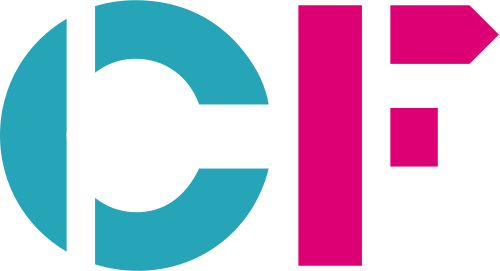

<div id="top"></div>

<!-- PROJECT LOGO -->
<br />
<div align="center">
  <a>
    
  </a>

  <h3 align="center">Name of project</h3>

  <p align="center">
    Comment about the project !
  </p>
</div>


<!-- TABLE OF CONTENTS -->
<details>
  <summary>Table of Contents</summary>
  <ol>
    <li>
      <a href="#about-the-project">About The Project</a>
      <ul>
        <li><a href="#built-with">Built With</a></li>
      </ul>
    </li>
    <li>
      <a href="#getting-started">Getting Started</a>
      <ul>
        <li><a href="#prerequisites">Prerequisites</a></li>
        <li><a href="#installation">Installation</a></li>
      </ul>
    </li>
    <li><a href="#usage">Usage</a></li>
    <li><a href="#roadmap">Roadmap</a></li>
  </ol>
</details>

<!-- ABOUT THE PROJECT -->

## About this project

This section should briefly explain what the project is about, and what the codebase is actually doing.
<p align="right">(<a href="#top">back to top</a>)</p>

## Getting started

### Prerequisites
The following are prerequisites to run this codebase:
 - Python
 - Poetry


 ### Installation
1. Install the poetry environment
   ```sh
   poetry install
   ```
<p align="right">(<a href="#top">back to top</a>)</p>

## Usage
Put all the steps that someone would need to run the codebase in this section

<p align="right">(<a href="#top">back to top</a>)</p>

## Roadmap

Keep this section in if you like ticking things off :)

[ ] - aim 1 <br>
[ ] - aim 2 <br>
[ ] - aim 3

<p align="right">(<a href="#top">back to top</a>)</p>